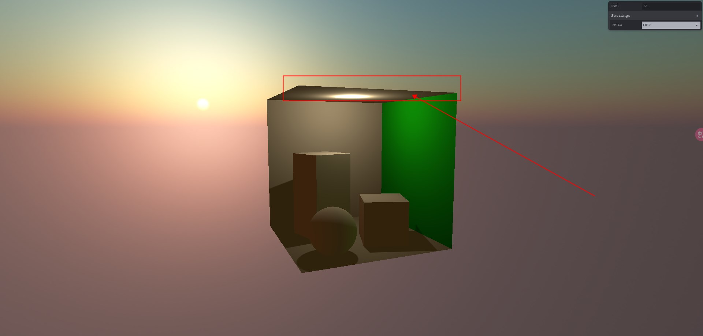
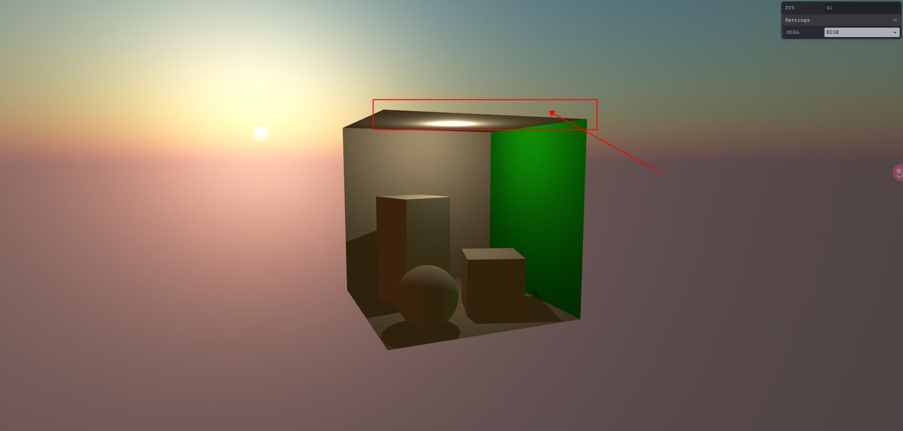
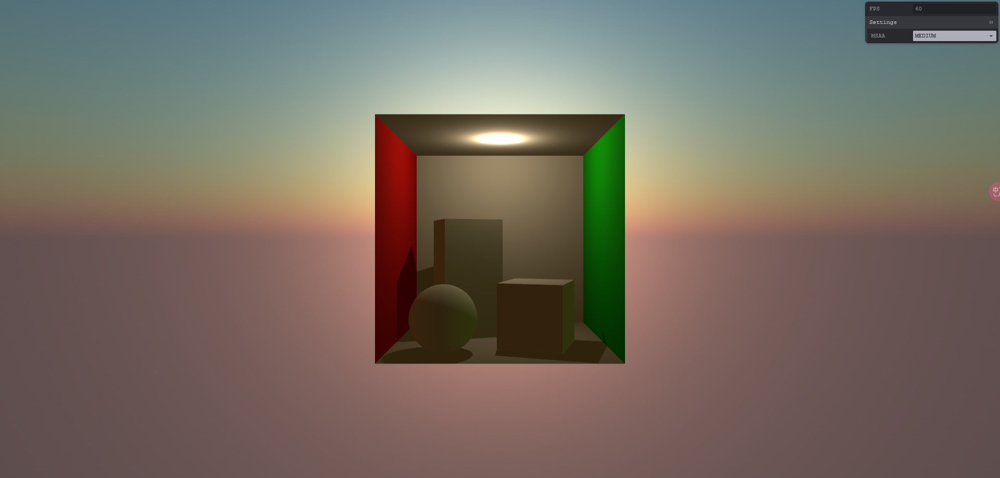

# MASS

> Multisample Anti-Aliasing（多重采样抗锯齿，简称MSAA）是一种图形渲染技术，用于减少计算机图像中的锯齿状边缘（锯齿化）和图像伪影（走样）现象。

<br />

## 1.背景

### 1.1 现象 - 锯齿状边缘

在计算机图形中，锯齿状边缘是由于图像中的直线或边缘在像素级别上呈现出锯齿状的锐利边缘。这是因为计算机屏幕和图像处理设备通常使用离散的像素网格来表示图像，而直线或边缘的位置可能不完全对齐于像素网格，导致边缘显示不光滑。

### 1.2 解决方案

抗锯齿技术旨在通过对图像进行额外的采样和插值来减少锯齿状边缘。

### 1.3 方案内容

MSAA是一种常见抗锯齿技术方法。

MSAA通过在每个像素位置上进行多个样本的采样，然后对这些样本进行插值来计算最终的像素颜色。这样可以减少锯齿状边缘的出现，并使边缘变得更加平滑。

<br />

## 2. 介绍

### 2.1 NSAA处理逻辑

在MSAA中，每个像素位置通常会有多个采样点，每个采样点都有自己的样本颜色值和深度值。在计算最终像素颜色时，根据这些样本值进行插值计算，以获得最终的抗锯齿效果。

通常使用的插值方法包括简单平均、加权平均或使用深度信息进行插值等。

### 2.2 NSAA优缺点

相比于其他抗锯齿技术，MSAA的优点之一是可以在较低的计算成本下提供较好的图像质量。

然而，它仍然存在一些局限性，例如对于透明度和多边形内部的走样问题，因此在某些情况下可能需要使用其他更高级的抗锯齿技术。

<br />

## 3. 使用

### 3.1 场景效果对比

> 以Three.js例子来对比效果:

1. 开启MSAA
   

2. 未开启MSAA
   

### 3.2 场景效果开发

1. 创建WebGLRenderer渲染器:

```ts
const renderer = new WebGLRenderer({
  powerPreference: 'high-performance',
  antialias: false,
  stencil: false,
  depth: false
})
renderer.debug.checkShaderErrors = window.location.hostname === 'localhost'
renderer.shadowMap.type = VSMShadowMap
renderer.shadowMap.autoUpdate = false
renderer.shadowMap.needsUpdate = true
renderer.shadowMap.enabled = true
```

2. 创建PerspectiveCamera相机:

```ts
const camera = new PerspectiveCamera()
```

3. 创建SpatialControls控制器:

```ts
const controls = new SpatialControls(
  camera.position,
  camera.quaternion,
  renderer.domElement
)
```

4. 添加Light光照:

```ts
scene.add(CornellBox.createLights())
```

5. 添加Environment环境:

```ts
scene.add(CornellBox.createEnvironment())
```

6. 添加Actors目标:

```ts
scene.add(CornellBox.createActors())
```

7. 添加MSAA后期处理:

```ts
const maxSamples = renderer.capabilities.maxSamples
const composer = new EffectComposer(renderer, {
  multisampling: Math.min(4, maxSamples)
})
composer.addPass(new RenderPass(scene, camera))
composer.addPass(new CopyPass())
```

效果如下图所示:



## 4. 相关资料

- [Three.js](https://threejs.org/)
- [postprocessing](https://github.com/pmndrs/postprocessing)
- [示例地址](https://postprocessing-study.vercel.app/msaa.html)
- [代码地址](https://github.com/WaterSeeding/postprocessingStudy)
